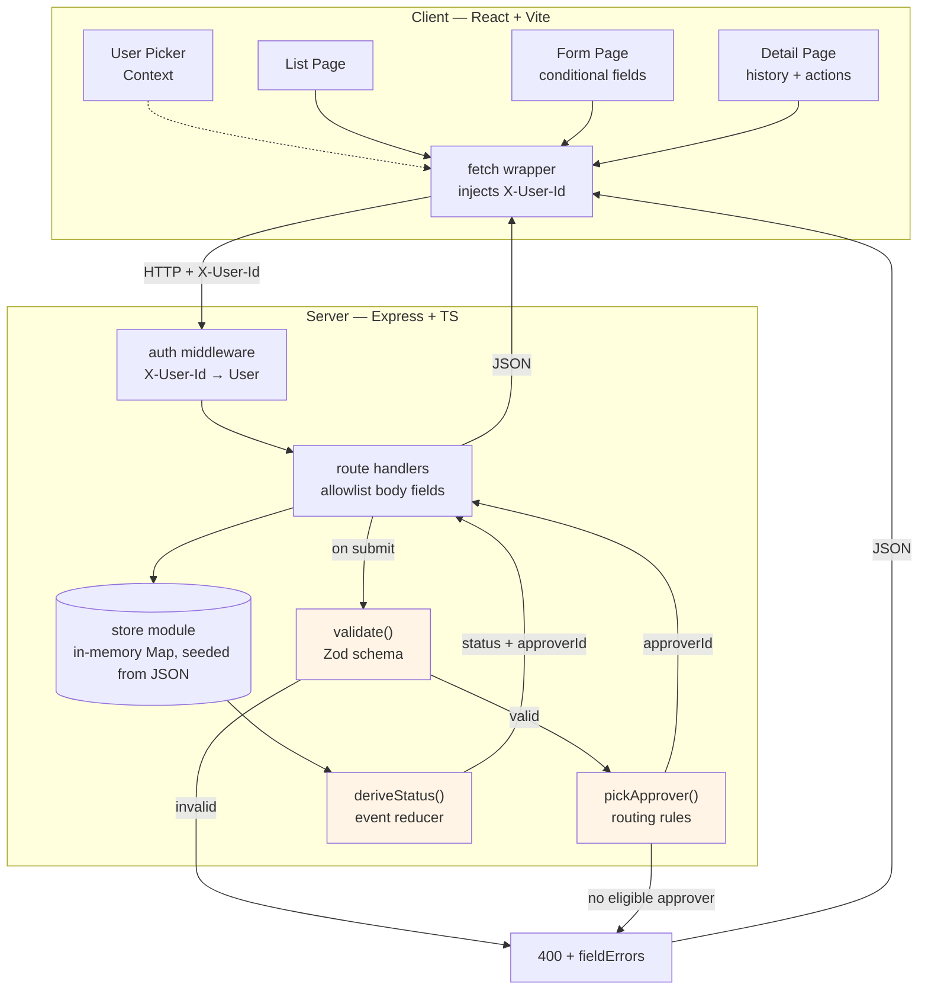
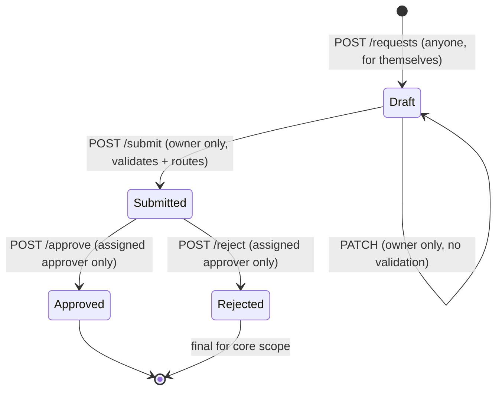

# ADR: High-Level Architecture

---

## 1. Context

An internal expense-request tool. Three things carry all the weight:

1. **Conditional form rules** — fields appear/become required based on other fields.
2. **An approval workflow** — Draft → Submitted → Approved/Rejected, with the *server* choosing the approver.
3. **Server-side enforcement** — validation, authorization, and status must hold against direct API calls, not just the UI.

Everything else (auth, persistence, styling, deployment) is explicitly allowed to be minimal. The grading signal is *correctness and explainability*, not breadth.

### Constraints

| Constraint | Implication |
|---|---|
| 3–4 hours total | No DB, no auth, no infra. Cut anything that isn't rules/workflow/API. |
| In-memory storage is fine | Single Node process, seed JSON loaded at boot, mutations live in a module-level `Map` keyed by id. |
| No form builder / workflow engine | Conditional rules and the state machine are hand-written. |
| Data-grid library discouraged | Plain `<table>`. |
| Seed data shape is given | Design the model *around* `requests.json` so there's no import/migration step. |

### Key observation from the seed data

`requests.json` has **no `status` field** — only an `events` array. Combined with requirement 6 ("the status always matches the latest action"), this strongly suggests status should be **derived from the event log**, not stored alongside it. See §5.

---

## 2. Decision (summary)

- **Monorepo** with npm workspaces: `/client`, `/server`, `/shared`. Shared TypeScript types + Zod schema are the contract between the two.
- **Backend**: Node + Express + TypeScript, in-memory store behind a `store` module, fake auth via `X-User-Id` header.
- **Frontend**: Vite + React + TypeScript, React Router in **Declarative mode**, Context API for the current-user picker, plain `fetch` wrapper for data, shadcn primitives (no `shadcn/form`).
- **Status is derived** from the request's event history by a pure reducer — never stored.
- **Three pure functions carry the business logic** — `validate()`, `deriveStatus()`, `pickApprover()` — each unit-testable with zero HTTP or React involved. This is the core architectural bet.
- **Validation with Zod** (decided) on the server, scoped to field shape only; the client re-runs the *same* schema for instant feedback but never gates on it.

---

## 3. Tech stack and rationale

All choices are drawn from the declared stack.

| Layer | Choice | Why | What was rejected |
|---|---|---|---|
| Language | TypeScript everywhere | Shared types between client/server prevent contract drift; discriminated unions model the event log well | — |
| Backend framework | Express | Smallest thing that does routing + middleware; fake-auth middleware is ~8 lines | Next.js API routes — couples the API's lifecycle to the frontend and makes "call the API directly" less obvious to demo |
| Storage | In-memory `Map` (keyed by id) behind a `store` module, seeded from JSON at boot | Explicitly permitted; zero setup cost; `get`/`save` are O(1) by id instead of an array scan; the module is a swappable seam if a DB were ever needed | MySQL/MongoDB — pure overhead here. File-backed JSON — see §4 |
| Frontend | Vite + React + TS | Fast dev loop, no framework opinions to fight | Next.js — SSR buys nothing for an internal tool behind a user picker |
| Routing | React Router, **Declarative mode** | Three routes; keeps Express as the only server in the repo (see §8) | Framework mode — runs its own server, competing with the one being graded |
| Client state | Context API (current user) + local component state | The only genuinely global state is "who am I pretending to be" (see §8) | Redux Toolkit / Zustand — no shared mutable client state to justify them |
| Data fetching | Hand-written fetch wrapper + one useApiQuery hook | Three read paths and three write paths; the wrapper owns headers and error parsing, the hook owns the read lifecycle | TanStack Query / SWR — caching, dedupe, and revalidation buy nothing over four-to-twenty records refetched per page, and neither is on the declared stack | 
| Styling / UI | Tailwind + shadcn **primitives only** | Radix under shadcn gives keyboard nav and ARIA on Select/Checkbox/Dialog for free; ~10 min setup | `shadcn/form` — pulls in react-hook-form; avoided on purpose (see §8) |
| Validation | **Zod** (decided) | Explicitly permitted by the FAQ; one schema expresses base + conditional rules, runs on both sides, and `flatten().fieldErrors` maps straight onto the API error shape | Hand-rolled validator — viable and dependency-free, but `superRefine` handles the three conditionals more legibly |
| Testing | Jest + Supertest (server), React Testing Library (client), Playwright (optional 1 flow) | Jest for the pure logic, Supertest for the "someone calls the API directly" tests | — |

**Deliberately cut:** Docker, MySQL/MongoDB, Storybook, Redux/Zustand, real auth, S3. Each is on the stack list but earns nothing inside the time budget — worth naming in `NOTES.md` as conscious cuts.

---

## 4. Repo layout, packages, and storage

### Package management

**Two `package.json` files minimum** — `/client` and `/server` have genuinely different dependency trees. On top of those, a root `package.json` with **npm workspaces** so a single `npm install` at the root covers both, plus root scripts (`dev:client`, `dev:server`) that give the reviewer one entry point. Roughly 5 minutes of setup.

**Fallback if workspaces turn fiddly:** drop the root package, run two independent installs, and make `/shared` a plain folder of `.ts` files that both sides import through a tsconfig path alias. No build step and no packaging, because Vite and `tsx` both compile TypeScript from source.

### The store

Everything sits behind a small `store` module exposing `list`, `getById`, and `save`. Seeding is exactly what it looks like: `JSON.parse(readFileSync('data/requests.json'))` at boot, loaded into a module-level `Map<string, ExpenseRequest>` keyed by `id` (same pattern for users, keyed by `id`). `getById` is a direct `map.get(id)` — no scanning. `save` is `map.set(request.id, request)`. `list` returns `Array.from(map.values())`. A restart resets to the four seed records.

**Why a `Map` over an array:** the store's whole job is id-keyed lookups (`getRequestById`, `getUserById`) plus occasional full listing. A `Map` makes the lookup path O(1) and explicit instead of an implicit `array.find(r => r.id === id)` repeated at every call site. `list()` still needs to iterate everything, so `Array.from(map.values())` covers it — the array-shaped API callers see doesn't change, only the internal representation.

**File-backed JSON was considered and rejected.** Writing state back to disk only helps on a long-lived host, and all it buys is "survives restart." It also costs real code — you'd need to write to a gitignored copy so the pristine seed survives, and use write-temp-then-rename to avoid corrupting the file on overlapping writes. For a 3–4 hour exercise where in-memory is explicitly blessed, stay in memory and spend one line of `NOTES.md` instead:

> In-memory by design; a restart resets state. The `store` module is the seam where a real datastore would go.

That sentence is worth more to a reviewer than the file-writing code. Keeping everything behind `store` makes this a one-file decision either way.

---

## 5. Data model and derived status

```
User          { id, name, role: 'employee'|'manager'|'finance', managerId: string|null }

ExpenseRequest{ id, requesterId, values: RequestValues, events: HistoryEvent[] }

RequestValues { expenseType, amountCents, description, billable,
                client?, additionalJustification?, otherReason? }

HistoryEvent  = { type:'created',   at, actorId }
              | { type:'submitted', at, actorId, approverId }
              | { type:'approved',  at, actorId }
              | { type:'rejected',  at, actorId }
```

This mirrors the seed file exactly, so there is no import or migration step.

### Status is derived, never stored

There is **no `status` key anywhere in storage**. The store holds `{ id, requesterId, values, events }` and nothing else.

- **On read:** `deriveStatus(request.events)` reads the last event's `type` and maps `created → Draft`, `submitted → Submitted`, `approved → Approved`, `rejected → Rejected`. `approverId` comes off the most recent `submitted` event. Both are attached to the API response as computed fields, so the client receives a normal-looking object and never has to know they were derived.
- **On write:** you never set a status. You append an event. The status changes as a *consequence*.

**Where the function lives:** server-side, with the computed value always sent down. Putting it in `/shared` and running it on both sides means two implementations that can drift, which defeats the point.

**Why it's worth doing:** requirement 6 says the status must always match the latest action. With a stored field you have to remember to update it in four handlers, and forgetting one produces a silent inconsistency — exactly the bug the requirement is probing for. Deriving makes the requirement true by construction; there is nothing to keep in sync.

**What it costs:** a small computation per read, and you can't filter by status without computing it first. Irrelevant at four-to-twenty requests. At 100k rows in a real database you'd denormalize a `status` column and keep the event log as the audit trail — that's the "what I'd revisit with more time" line, and a good one, because it shows the trade-off was chosen rather than stumbled into.

This is *not* event sourcing. It's a four-case reducer over a short array.

---

## 6. API surface, fake auth, and mass assignment

### Fake auth

`X-User-Id` is a **custom HTTP request header**. Every `fetch` from the client sets it: `headers: { 'X-User-Id': currentUser.id }`.

It occupies the same architectural slot a JWT would: middleware reads a credential off the request, resolves it to a `User`, attaches `req.currentUser`, or returns 401. The only difference is trust — a JWT is signed so the server can verify it wasn't forged; a plain header is trivially spoofable with `curl`. That's acceptable and explicitly permitted here, and the *shape* being right is what matters: swapping in real auth later means rewriting the body of one middleware function and nothing else.

Worth stating explicitly in the walkthrough: **authentication is fake, authorization is real.** Owner-only edits and approver-only approvals are all checked against `req.currentUser.id` on the server.

### The client's API layer

`api/client.ts` is a thin `fetch` wrapper — not a package. It owns exactly what
is identical across every call: base URL, `Content-Type`, the `X-User-Id`
header, `res.ok` checking, and parsing the error contract above into a typed
`ApiError { status, code, message, fieldErrors? }`. It exports
`api.get / api.post / api.patch`.

`ApiError` carrying `fieldErrors` is what keeps the form's submit handler short:
one `instanceof` check distinguishes a validation failure (render next to the
inputs) from anything else (banner).

**Where the header value comes from:** `client.ts` is not a component, so it
cannot call `useContext`. The current user id is read from `localStorage` — the
same key `CurrentUserProvider` already persists to (§8). A module-level variable
written by the provider is the more "real token client" alternative; both are two
lines. What is deliberately avoided is threading `userId` as a parameter through
every call site — that pollutes fifteen places to solve a problem in one.

### Mass assignment — why the client can't set `status`, `requesterId`, or `approverId`

Requirement 5 is fishing for a specific bug. Suppose PATCH were written as:

```
Object.assign(request.values, req.body)   // ← the bug
```

Then anyone can `curl -X PATCH -d '{"requesterId":"u_carol","status":"Approved"}'` and either steal ownership of a request or skip the approval workflow entirely.

So handlers read fields **by name — an allowlist — and never spread the body**:

- `requesterId` is taken from `req.currentUser.id` at creation. Never from the body, ever.
- `approverId` is computed by `pickApprover()` at submit time. Never from the body.
- `status` isn't stored at all (§5), so there's nothing to set — and the derived value comes from events only the server appends.

"Strips them if present" means those keys are silently ignored because nothing reads them. The alternative is a `.strict()` Zod schema that 400s instead; ignoring is friendlier, rejecting is louder, either is defensible. Whichever is chosen, there's an integration test that POSTs a body stuffed with `requesterId`/`approverId`/`status` and asserts none of them took effect. That test is a good thing to have on screen during the demo.

### Endpoints

| Method | Path | Rules enforced |
|---|---|---|
| `GET` | `/api/users` | — (populates the picker) |
| `GET` | `/api/requests` | returns all, with derived status + requester name |
| `POST` | `/api/requests` | creates Draft; `requesterId` = caller; adds `created` event |
| `GET` | `/api/requests/:id` | full record + history |
| `PATCH` | `/api/requests/:id` | owner only; Draft only; **no validation** (partial saves allowed) |
| `POST` | `/api/requests/:id/submit` | owner only; Draft only; validates; routes approver; adds `submitted` event |
| `POST` | `/api/requests/:id/approve` | assigned approver only; Submitted only |
| `POST` | `/api/requests/:id/reject` | assigned approver only; Submitted only |

### Error contract

```
400  { error: 'VALIDATION_FAILED',  fieldErrors: { amountCents: '...', client: '...' } }
400  { error: 'NO_ELIGIBLE_APPROVER', message: '...' }   // finance would be the requester
403  { error: 'FORBIDDEN', message: 'Only the requester can submit this request' }
409  { error: 'INVALID_TRANSITION', message: 'Only a Draft can be submitted' }
```

`fieldErrors` keyed by field name is what requirement 6 asks for ("the response says which fields are wrong"), and it drops straight into the form.

---

## 7. Data flow



The three shaded boxes are pure functions with no Express or React dependency — that's what makes the high-value tests cheap to write.

### Status transitions



Rejected → Draft/Submitted only opens up if the resubmit stretch goal is taken.

### Routing rules (pseudocode)

```
pickApprover(requester, amountCents, users):
    finance  = users.find(role == 'finance')
    manager  = users.find(id == requester.managerId)

    candidate = amountCents >= 100000 ? finance : manager

    if candidate is missing OR candidate.id == requester.id:
        candidate = finance

    if candidate is missing OR candidate.id == requester.id:
        throw NO_ELIGIBLE_APPROVER

    return candidate.id
```

Two seed cases this must get right: **Mallory** (a manager, `managerId: u_peggy`) submitting $600 routes to Peggy, not to herself. **Trent** (finance) submitting anything ≥ $1,000 has no eligible approver and must be refused.

---

## 8. Frontend architecture

### React Router — Declarative mode

The docs describe three modes, additive in features and inversely so in architectural control: Declarative (`BrowserRouter` + `Routes`/`Route`), Data (`loader`/`action`/`useFetcher`), Framework (Data + a Vite plugin, type-safe route modules, SSR/SSG).

**Declarative is the choice.** Reasoning:

- **Framework mode is actively wrong here.** It runs its own server, which competes with the Express server that is the centerpiece of this assignment. The reviewer's core question is "where are the rules enforced," and two servers in one repo muddies that answer for zero benefit, plus config time there isn't budget for.
- **Data mode is defensible but not worth it.** Loaders would replace manual `useEffect` fetching and give pending states and automatic revalidation — genuinely nicer, but a ~15-minute detour for three routes and about six fetch calls.
- **Data mode also collides with the Context decision below.** Loaders run outside React rendering, so a loader cannot call `useContext`. The current user would have to come from `localStorage` or a module-level singleton that Context also reads — a small but real awkwardness for no gain.

One clarification worth keeping straight: loaders don't provide "server state" in the SSR sense. In Data mode they run *in the browser*; the router just owns fetch orchestration and revalidation instead of you doing it in `useEffect`. Only Framework mode with SSR runs them on a server.

### Why Context, then?

The only genuinely global *client* state in this app is "who am I acting as." That isn't server data — it's a UI-level selection that every single API call depends on. `CurrentUserProvider` sits at the root, the header dropdown writes to it, the fetch wrapper reads from it. Everything else — the request list, a single request — is server data fetched per page and has no business in Context.

That's the line to draw out loud in the demo: **Context for ambient identity, not as a general state store.** It's also why Redux and Zustand appear on the stack list but not in this design — there is no shared mutable client state to justify either.

### Reads are declarative, writes are imperative

Two different shapes, deliberately not unified:

- **Reads** — "this page needs this data, keep it in sync with who I am." The
  trigger is rendering and the dependency array does the work. One
  `useApiQuery(path)` hook covers all three: `GET /requests`,
  `GET /requests/:id`, `GET /users`. Returns `{ data, loading, error, refetch }`.
- **Writes** — "on click, do this, then that, and handle these failure modes
  differently." The trigger is an event; the error handling is call-site
  specific. These stay as imperative `api.post` / `api.patch` calls inside
  handlers.

Three mutation call sites, each with different post-success behaviour (navigate
vs. refetch) and different error rendering — `fieldErrors` next to inputs on the
form, a message banner on the detail page. A generic `useMutation` would take
the five decisions in §9 and bury them behind config. There is nothing to factor
out but the `fetch` boilerplate, and `api.post` / `api.patch` already did that.

**Inside the hook, three things earn their place:**

- `currentUser.id` in the deps — this *is* the implementation of "switching
  users refetches the current page."
- `refetch` — the detail page needs it: approve → refetch → history grows.
- `path: string | null` — lets the form page call the hook unconditionally and
  pass `null` in create mode, rather than conditionally calling a hook.

**`AbortController` in the effect cleanup.** Switching users fires a refetch;
flipping Alice → Carol → Alice quickly can land responses out of order, leaving
the page rendering Carol's data under Alice's header. A `let cancelled` closure
flag fixes the same bug in two fewer lines; `AbortController` additionally
cancels the in-flight request, and "the cleanup aborts it" is a cleaner answer
to a reviewer than "a closure variable guards the setState."

**Explicitly not in the hook:** no options bag (`{ method, body, deps, enabled,
transform }` is a library with one user), no cache, no dedupe, no retry.

### Switching users

A **persistent dropdown in the app header, visible on every page**. Selecting a different user immediately changes the `X-User-Id` the API client sends, and the current page refetches. No login page, no logout — switching is instant.

Two cheap additions: persist the selection in `localStorage` so a refresh doesn't reset you, and show the current user's **name and role** in the header so it's always obvious whose eyes you're looking through.

The reason this beats a login/picker page: during the demo you want to sit on a request's detail page, switch from Alice to Carol, and watch the Approve/Reject buttons appear in place. A separate login route forces a navigation round-trip every time and makes that moment clumsier.

### shadcn — primitives only, no `shadcn/form`

Using shadcn for the accessibility win, but restricted to a small primitive set: `Button`, `Input`, `Select`, `Checkbox`, `Textarea`, `Label`, `Table`, `Badge`. Radix underneath handles keyboard navigation and ARIA on Select and Checkbox, which is otherwise fiddly hand-written work.

**`npx shadcn add form` is deliberately not used.** It pulls in react-hook-form plus the Zod resolver. That arguably doesn't trip the "no ready-made form builder" rule — the prohibition targets schema-driven form *generators* (Formily, JSONForms, SurveyJS) and workflow engines, and react-hook-form generates nothing; you still hand-write every field and every conditional. But it's the kind of thing a reviewer could raise, and with seven fields the cost of avoiding it is roughly 20 extra lines of `useState` wiring. Taking the version with zero room to argue.

---

## 9. Validation and the submit flow

**Decided: Zod.** The FAQ explicitly permits a validation library so long as the server still enforces the rules. It also doesn't touch the "no ready-made form builder or workflow engine" constraint — Zod renders nothing, decides no field visibility, and knows nothing about approvals. Every conditional is still hand-written inside `superRefine`.

One Zod schema, defined in `/shared`, used by both sides:

- **Base**: `expenseType` ∈ enum; `amountCents` integer ≥ 0; `description` non-empty.
- **Conditional** (`superRefine`): `client` required when `billable === true`; `additionalJustification` required when `amountCents >= 100000`; `otherReason` required when `expenseType === 'Other'`.
- **Draft saves skip it entirely** — PATCH accepts a partial object with no rule checks.

**Scope boundary — Zod validates field shape, nothing else.** `pickApprover()` and the status transitions stay plain hand-written functions with their own unit tests. Routing is business logic, not shape validation, and expressing it as a schema refinement would blur exactly the line the constraint cares about.

`error.flatten().fieldErrors` produces the `{ fieldName: [messages] }` shape requirement 6 asks for directly, which is where the dependency earns its keep — at the API boundary, not just internally.

For `NOTES.md`:

> Zod validates field shape and the three conditional rules; approver routing and status transitions are hand-written, per the no-workflow-engine constraint.

Clients are a hardcoded list: `Acme` (used by seed data), `Globex`, `Initech`, `Contoso`. Dollars↔cents conversion lives in exactly one place in `/shared` and is unit-tested — `"12.50" → 1250` is a classic source of floating-point bugs.

### Sharing the schema across two deployments

The sharing is at **build time, not runtime**. `/shared/validation.ts` is source compiled into the client bundle *and* the server bundle; each ends up with its own independent copy. Deploying the two to different hosts changes nothing.

The real risk isn't topology, it's **version skew** — a server deployed with a tightened rule while the client still serves a bundle compiled from the old schema. This is precisely why the server is authoritative and the client's copy is decorative: when they disagree, the server's `fieldErrors` wins.

One mechanical note if the app ever is deployed: whatever builds each side must have `/shared` in its build context. As an npm workspace package, that means pointing the build at the repo root rather than `/client`. The friction-free version is `/shared` as plain `.ts` files behind a tsconfig path alias — both bundlers compile it from source, nothing to package, works on any host.

### Submit button behaviour

Two distinct reasons a button might be disabled, and only one of them is used:

- **Disabled while a request is in flight** — yes. Prevents double submission.
- **Disabled because client validation says the form is invalid** — no. A permanently greyed-out button explains nothing; the user hunts for the problem. It also means the server's validation path never gets exercised through the UI, and that path is the thing being graded.

The flow:

1. Button enabled whenever `!isSubmitting`.
2. Click → run client-side Zod validation.
3. **Invalid** → render field errors inline, focus the first bad field, **don't call the API**, button stays enabled so the user can fix and retry.
4. **Valid** → `setIsSubmitting(true)`, disable button + spinner, **persist the values** (`POST /requests` in create mode, `PATCH /requests/:id` in edit mode), then `POST /requests/:id/submit`.
5. **Server returns 400 + `fieldErrors`** → render those errors, re-enable the button.
6. **Server returns 200** → navigate to the detail page.

Refinement: don't show errors until the first submit attempt, then re-validate on change so they clear as the user fixes them. Validating on every keystroke from an empty form is noisy and hostile.

### Save and submit are two requests

`POST /requests/:id/submit` takes no body, so the form must persist its values before submitting. That's a deliberate consequence of the API shape in §6, and it has two visible effects worth being able to defend.

**A failed submit still persists the values.** PATCH succeeds, `/submit` returns 400, and the draft now holds the newer values. This is the behaviour we want — the draft *is* the user's work-in-progress, and discarding it because a conditional field was missing would be worse than keeping it. The alternative, a single `POST /submit` that accepts a body, collapses the two calls at the cost of giving PATCH and submit two different ways to write the same fields; the split keeps "save" and "submit" as one job each.

**Create mode must claim its id before submitting.** The first write on `/requests/new` is `POST /requests`, not PATCH. As soon as it returns, the form holds an id and replaces the URL with `/requests/:id` — *before* calling `/submit`. Without that, a 400 from `/submit` leaves the user on `/requests/new` holding no id, and the obvious retry creates a second orphan draft. Every write after the first one in a session is a PATCH.

**Dollars convert to cents on every write, not just on submit.** The amount input holds a dollar string in local state; `dollarsToCents` runs on the way out of both Save Draft and Submit. Converting only on the submit path would persist `"45.00"` into a field typed `amountCents: number` and hand it back wrong on reload.

For `NOTES.md`:

> Client-side validation is a UX convenience only — deleting it entirely would leave the app fully correct, because the server returns the same `fieldErrors`.

That sentence makes the "server is authoritative" claim concrete rather than aspirational, and it's a good thing to be able to say out loud in the walkthrough.

---

## 10. Testing strategy

Inverted-effort pyramid: nearly all effort on server logic, a thin layer on the UI.

| Tier | Tool | Target | Cases |
|---|---|---|---|
| **Unit — highest value** | Jest | `validate()` | each conditional rule fires and clears; negative amount; the $1,000 boundary exactly (99999 / 100000); zero |
| **Unit — highest value** | Jest | `pickApprover()` | under threshold → manager; at/over → finance; missing manager → finance; manager *is* requester → finance; finance is requester → throws |
| **Unit** | Jest | `deriveStatus()` | each event type; ordering; empty history |
| **Unit** | Jest | cents conversion | round-trip, `.5` cases |
| **Integration** | Supertest | HTTP layer | happy path create→edit→submit→approve; create→submit→reject |
| **Integration — security** | Supertest | direct API abuse | submit someone else's draft (403); approve as non-approver (403); PATCH a Submitted request (409); POST with `status`/`approverId`/`requesterId` in the body (silently ignored) |
| **Component** | RTL | Form | conditional fields appear/disappear; server `fieldErrors` render next to the right inputs |
| **E2E (optional)** | Playwright | one flow | submit as Alice → switch user → approve as Carol. Only if time remains |

**Explicitly not tested:** Express wiring, Tailwind classes, the store's get/set. Coverage percentage is not a goal — the two logic functions above and the security-boundary integration tests are.

The `NOTES.md` "what I tested" section writes itself from this table.

---

## 11. Deployment (optional, not required)

The assignment asks for a GitHub repo with run steps in `NOTES.md`, not a live URL. Deploying is optional polish that can easily eat an hour. If it happens anyway:

- One repo, two deploys is the normal pattern — Vercel supports two projects from one repo with different Root Directory settings; Firebase Hosting + Cloud Functions is equivalent.
- Different origins means `cors` middleware on the server and a `VITE_API_URL` env var on the client.
- **Serverless breaks the in-memory store.** Each invocation may get a fresh container, so a request created in one call may not exist in the next. A working deployed demo needs a long-lived Node process (Render, Railway, Fly), not Lambda-style functions.

---

## 12. Trade-offs and consequences

**What gets easier**
- Business rules are pure functions → tests are fast and readable, and they're the natural thing to walk through in the demo.
- Shared types + shared Zod schema → the client can't drift from the server contract.
- Derived status → the "status matches latest action" requirement can't be violated.
- One `store` module → swapping to real persistence touches one file.

**What gets harder**
- No persistence: a server restart resets everything. Acceptable and explicitly allowed; mention in `NOTES.md`.
- In-memory mutation is not concurrency-safe. Single-user demo makes this moot; worth naming as a known limitation.
- Deriving status on every read is O(events) — irrelevant at this scale, would be revisited with pagination or a real datastore.
- Declarative routing means manual fetch/pending handling. A single ~25-line useApiQuery hook absorbs it for the three read paths; mutations stay explicit by design (§8). Accepted — the app is small enough that it stays tidy, and the hook is what makes that true rather than aspirational.